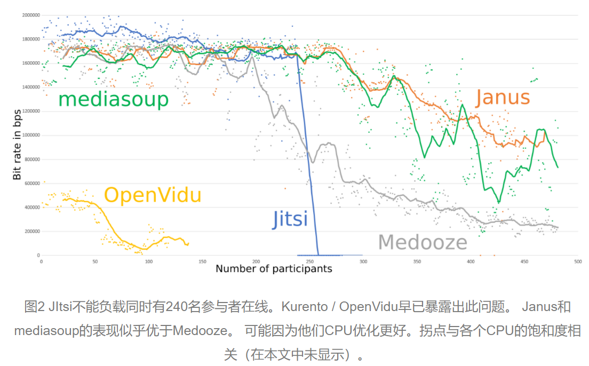

# 可行性总结
**直播模型**
<br>
||||||||||||||||
<br>
**资源消耗**
<br>
|||||||||||||||
<br>
**协议、软件选择**

## 直播服务模型
- 直播服务模块 

- 直播流媒体服务器，它是整个运营平台的核心零件。它的性能与稳定性好坏直接决定者核心业务平台的稳定性与运营成本。
   <br>
## 媒体服务器所消耗的资源
- 云主机
    - 计算和网络性能和稳定性较高的主机。
    - 100并发大约需要2核cpu，4G内存
    - 1000并发约需8核cpu，32G内存
- 网络带宽
    - 视频播出网络需求跟并发需求直接相关，计算公式如下：
     
               带宽需求 = 播出码率 x 并发数
     
      一般720p视频播出使用800Kpbs 到 1Mbps的码率，则100并发需要100Mbps的出口带宽。
    - 阿里云直播按流量收费标准
    - 腾讯云直播收费标准
- 存储性能
    - 配置多大的存储，主要看要存储多少视频资源。由于视频资源上传到流媒体服务器后是要进行转码压缩存储的，因此所需的存储相对于存储原始视频会小得多。
      
      存储需求计算公式如下：
      
                     存储量 = 播出码率*播出时长/8
      
      例如，对于一般高清视频，播出码率在2Mbps左右，1小时（3600秒）的存储需求为：
      
                     2*3600/8 = 900 MB
      
      可以看到，1个小时的高清视频经压缩后，大概占用900MB的存储，接近1GB。这样算下来，1000个小时的资源大概需要1TB的存储。
  
### 直播技术的现状
- 实现直播有三种协议：
    - RTMP
    
      RTMP 是 Real Time Messaging Protocol（实时消息传输协议）。
      主要用来在 Flash/AIR 平台和支持 RTMP 协议的流媒体/交互服务器之间进行音视频和数据通信。支持该协议的软件包括 Adobe Media Server/Ultrant Media Server/red5 等。
      - 优点
        - CDN 支持良好，主流的 CDN 厂商都支持
        - 协议简单，在各平台上实现容易
      - 缺点
        - 基于 TCP ，传输成本高，在弱网环境丢包率高的情况下问题显著
        - 不支持浏览器推送
        - Adobe 私有协议，Adobe 已经不再更新
    - WebRTC
    
      WebRTC 是 Web Real-Time Communication（网页即时通信），
      是一组支持网页浏览器进行实时语音对话或视频对话的 API。它于 2011 年 6 月 1 日开源并在 Google、Mozilla、Opera 支持下被纳入万维网联盟的 W3C 推荐标准。  
      - 优点
        - W3C 标准，主流浏览器支持程度高
        - Google 在背后支撑，并在各平台有参考实现
        - 底层基于 SRTP 和 UDP，弱网情况优化空间大
        - 可以实现点对点通信，通信双方延时低
      - 缺点
        - ICE,STUN,TURN 传统 CDN 没有类似的服务提供
    - 基于UDP的私有协议
    
        有些直播应用会使用 UDP 做为底层协议开发自己的私有协议，因为 UDP 在弱网环境下的优势通过一些定制化的调优可以达到比较好的弱网优化效果，但同样因为是私有协议也势必有现实问题：
        - 优点
        ·更多空间进行定制化优化
        - 缺点
        ·开发成本高
        ·CDN 不友好，需要自建 CDN 或者和 CDN 达成协议
        ·独立作战，无法和社区一起演进
        
### WebRTC多人视频通信常用架构Mesh/MCU/SFU

WebRTC 虽然是一项主要使用p2p的实时通讯技术，本应该是无中心化节点的，但是在一些大型多人通讯场景，如果都使用端对端直连，端上会遇到很带宽和性能的问题，所以就有了下图的三种架构。
- Mesh

    每个端都与其它端互连。般这种架构只能支持4-6人左右，不过优点也很明显，没有中心节点，实现很简单。
- MCU(MultiPoint Control Unit)

    这是一种传统的中心化架构(上图中间部分)，每个浏览器仅与中心的MCU服务器连接，MCU服务器负责所有的视频编码、转码、解码、混合等复杂逻辑，每个浏览器只要1个连接，整个应用仅消耗5个连接，带宽占用(包括上行、下行）共10m，浏览器端的压力要小很多，可以支持更多的人同时音视频通讯，比较适合多人视频会议。但是MCU服务器的压力较大，需要较高的配置。
- SFU(Selective Forwarding Unit)
    
    仍然有中心节点服务器，但是中心节点只负责转发，不做太重的处理，所以服务器的压力会低很多，配置也不象MUC要求那么高。但是每个端需要建立一个连接用于上传自己的视频，同时还要有N-1个连接用于下载其它参与方的视频信息。所以总连接数为5*5，消耗的带宽也是最大的，如果每个连接1M带宽，总共需要25M带宽，它的典型场景是1对N的视频互动。

### WebRTC 开源框架性能测试
主流的SFU开源框架有以下：
- [Janus](https://janus.conf.meetecho.com/)
- [Jitsi](https://meet.jit.si/)
- [Kurento](http://www.kurento.org/)
- [mediasoup](https://mediasoup.org/)
- [Medooze](http://www.medooze.com/)
- **这些框架负载测试的结果**
    - 一份来自 testRTC 对 Kurento 的测试结果（2017.9.13）：
    
        在未优化的情况下，服务器硬件素质为：AWS的c6g.2xlarge，8核CPU，16G内存，结果为
    - 一份对上述开源框架的测试（2018.10.18）：
       - 
       - 
       -             	
       ```
        首先要向大家声明：所有团队均已查看、评估了SFU的结果。
        早些时候，Kurento Media Server团队意识到他们的服务器崩溃，我们正在与他们合作解决这个问题。在Kurento / OpenVidu上，我们测试了最多140个数据流（因为它早前就崩溃了）。
        此外，libnice中存在一个已知错误。在我们的初始测试期间，这一错误同时影响了Kurento / OpenVidu和Janus。在Janus团队的建议应用libnice补丁后，我们得到的结果有了显著改善。但是使用Kurento / OpenVidu上的补丁进行重新测试时，情况更加糟糕了。我们的结论是Kurento存在其他问题。我们正在与他们联系并进行修复，Kurento / OpenVidu的测试结果很快会得到改善。
        最新版本的Jitsi Videobridge（截至本文发布时），在240位用户同时在线时表现不稳定。 Jitsi团队意识到了这一点，正努力解决问题。但是他们指出，一般他们会建议依赖水平缩放，并使用大量的这种较小实例。请注意：以前的版本（即两个月前）没有这些稳定性问题，但性能也不佳（下一节中会深入讨论这个问题）。所以我们选择保留版本0.1.1077，因为它联播更好，显著改善了240位参与者时的测试结果。
        还应注意：自测试以来，所有这些产品基本都有版本更新。在测试结果公布之后，已有一些产品做出了改进。
      ```  
### 媒体服务器总结
- Kurento

    借助Kurento, 你可以构建任何类型的后端媒体处理功能：SFU,MCU,recording，transcoding,gateway等等。
    功能全面，文档完善，使用方便，模块编程，易于扩展，性能较差，代码庞大
- Mediasoup
    
    性能优秀，支持WebRTC新特性，功能较少，信令模块只提供node.js版本。 
- Janus

    Janus 整体架构采用了插件的方案,支持的功能非常多，比如支持 SIP、 RTSP、音视频文件播放、录制,底层的代码是由 C 语言编写的，性能也非常强劲。Janus 的开发、部署手册也非常完善,官方提供有ios和android的sdk。
    缺点是，架构太复杂，不适合初学者，公司采用的话人力成本和事件成本会比较高，janus 底层没有使用 epoll 这类异步I/O事件处理机制，Janus还使用 glib 库，由于 glib 库对于国内的很多开发同学来说用的比较少，所以会有一定的学习成本
- Medooze

    Medooze 的控制逻辑层是通过 Node.js 实现的，Medooze 与 Mediasoup 相比，两者在核心层实现的功能都差不多，但 Medooze 的功能更强大，包括了录制、推 RTMP 流、播放 FLV 文件等相关的操作，而 Mediasoup 则没有这些功能。它在接收 / 发送音视频包时性能比 Mediasoup 要稍差一些。
- Jitsi

    使用Java构建的服务端，底层也是使用c/c++，Jitsi是一个处理XMPP信号流的SFU，适用于SIP/XMPP视频通话，会议，聊天，桌面共享，文件传输。如果你不需要SFU或者使用其他信号协议，最好还是使用其他项目。但由于Jitsi项目的简单明了，很多外包供应商很喜欢使用Jitsi，将它集成到自己的项目案例当中。

- RTMP 服务器支持 WebRTC
    - SRS 单台并发>1000
    - NTV Media Server G3  单机并发5000,具有文件缓存、用户限流、文件句柄复用、网卡数据拷贝等高级功能，售后服务好
      
### 感受
- webrtc 解决了回声消除
### 参考
- [为什么要搞这么多架构？](https://www.cnblogs.com/yjmyzz/p/webrtc-multiparty-call-architecture.html)
- [多方 webrtc 的选择](https://kebingzao.com/2020/06/19/webrtc-multi/)
- [RTMP vs. WebRTC ](https://blog.csdn.net/TTKatrina/article/details/73551267)
- [史上最全的WebRTC服务器技术选型分析](https://my.oschina.net/u/3937935/blog/4331261)
- [流媒体服务器搭建](https://bbs.huaweicloud.com/blogs/189403)
- [STUN, TURN, ICE介绍](https://developer.aliyun.com/article/243540)
- [基于Kurento搭建WebRTC服务器](https://blog.gmem.cc/webrtc-server-basedon-kurento)
- [ Breaking Point: WebRTC SFU Load Testing (Alex Gouaillard)](https://webrtchacks.com/sfu-load-testing/)
- [How Many Sessions Can a Kurento Server Hold?](https://testrtc.com/sessions-kurento-server/)
- [导航](https://github.com/DyncLang/DevLiveBook)